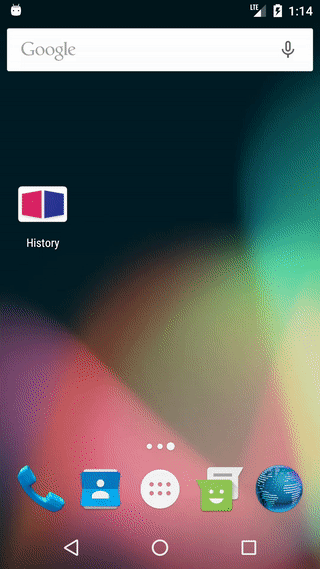

# History

Utility to maintain a linear history of arbitrary entries (_backstack_ if you wish). Includes ready to be used `ScreenManager` which maintains screens (view-based components) by observing the `History` changes.

---



---

Usage of `History` is straight-forward:

```java
final History<Key> history = History.create(Key.class);
history.push(Entry.create(Key.FIRST));
history.replace(Entry.create(Key.SECOND, new SecondState()));
history.pop();
history.popTo(history.first());
history.clear();
```

There are few important things to note:

* `Key.class` is an enum
* Each `Entry` has 2 fields: `key` and `state`
* * `key` is Enum class value
* * `state` is an arbitrary object that implements `Parcelable`


In order to receive updates one must subscribe for them:

```java
final Subscription subscription = history.observe(new MyHistoryObserver());

// unsubscribe when needed
subscription.unsubscribe();
```

```java
private class MyHistoryObserver implements History.Observer<Key> {

    @Override
    public void onEntryPushed(@Nullable Entry<Key> previous, @NonNull Entry<Key> current) {

    }

    @Override
    public void onEntryReplaced(@Nullable Entry<Key> previous, @NonNull Entry<Key> current) {

    }

    @Override
    public void onEntryPopped(@NonNull Entry<Key> popped, @Nullable Entry<Key> toAppear) {

    }

    @Override
    public void onEntriesPopped(@NonNull List<Entry<Key>> popped, @Nullable Entry<Key> toAppear) {

    }
}
```

* `onEntryPushed` and `onEntryReplaced` can receive null Entry as `previous` **only** if current History is empty (thus pushed/replaced entry will be the root)
* `onEntryPopped` and `onEntriesPopped` can receive null Entry as `toAppear` **only** if this operation removes all entries from history (it becomes empty).

```java
// Parcelable that can be persisted in Bundle
final HistoryState state = history.save();

// throws an exception if history is not empty
history.restore(state);
```

When restoring state, `History` will notify observers with `push` event for each persisted in state entry.

If you want to prebuild `HistoryState` you can use `HistoryBuilder`:
```java
final HistoryState state = History.builder(Key.class)
        .push(Key.FIRST)
        .push(Key.SECOND, new SecondState())
        .push(Entry.create(Key.THIRD, new ThirdState()))
        .pushIf(true, Key.FORTH)
        .pushIf(false, Key.FIFTH, new FifthState())
        .pushIf(true, Entry.create(Key.SIXTH, new SixthState()))
        .build();
```


# Why not having essential Activity events passed to ScreenManager

I decided **not** to include `onActivityResult`, `onBackPressed` and `onRequestPermissionResult`
into `ScreenManager` in order to keep one single source of truth for them. Library provides
simple abstraction in shape of plugins, that should handle subscription for these events.

**do not** block drawing in `onAttach` as it can possibly block drawing of the whole layout,
you still can use OnPreDrawListener, but it must return true. This is because `onAttach` can
be called after restoring state and if a screen has not-null Visibility, its `onAttach` will be
called, but never 

**why it's important to set start values** in change: if layout structure was restored,
views won't be holding information of their previous positions

**NB** if you implement own ChangeController (and not using builder) then in `back` method
to & from screens are swapped (indicating actual to & from transition), so when going back
the active screen will be `from` and inactive screen will be `to` (not how they were initially)